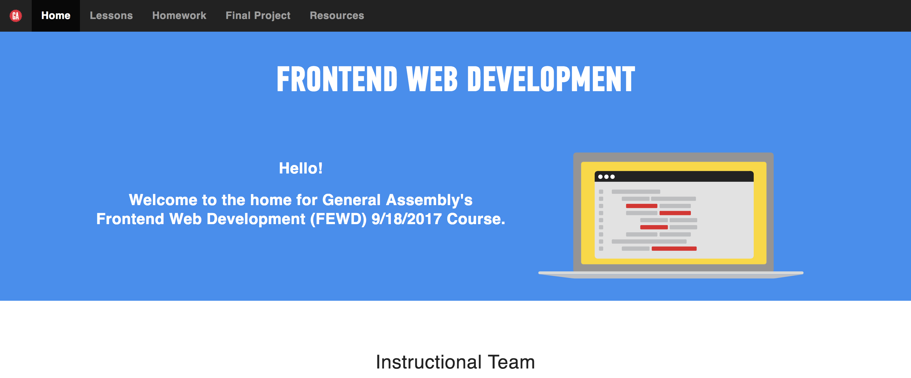
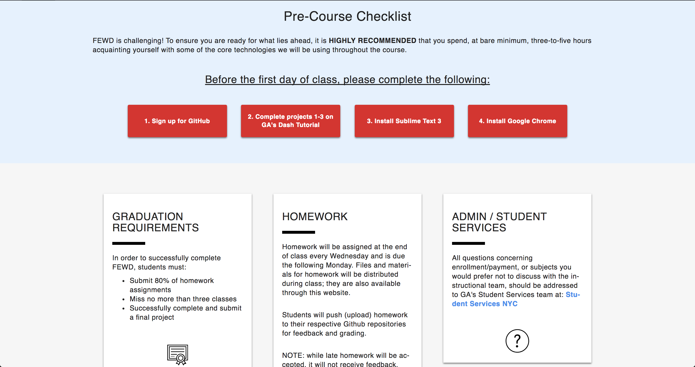
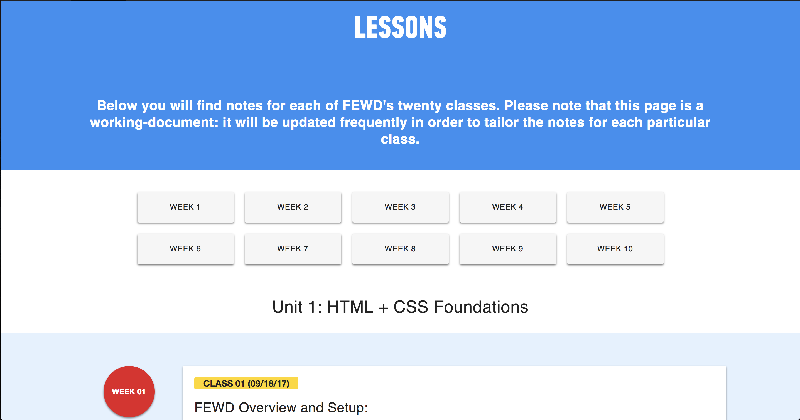
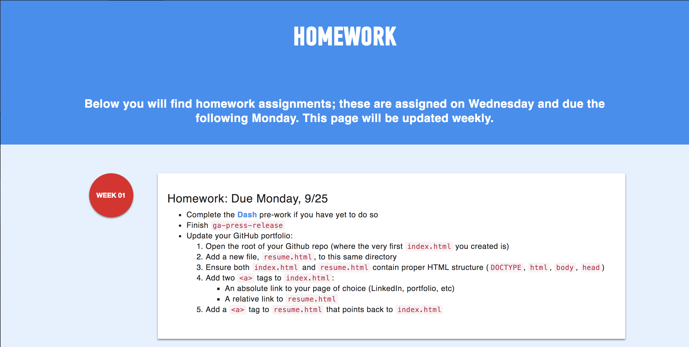
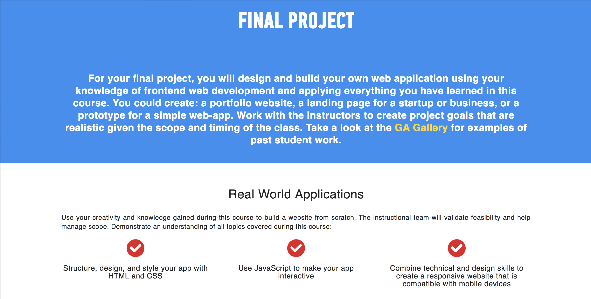

	

# FEWD: Static Webportal

A web portal for assistance teaching [General Assembly's](https://generalassemb.ly) part-time Frontend Web Development (FEWD) course. Can easibly be adapted for JavaScript Development (JSD) or other part-time classes and workshops.

To see this project in action, visit [https://fewd.nyc](https://fewd.nyc).

A complete version of this project (web portal and corresponding slides) can be found here: [https://github.com/cheshireoctopus/gafewd](https://github.com/cheshireoctopus/gafewd).

### Recommended Setup:

1. Replace instructor images in `img/`
2. Add page tracking scripts (eg Google Analytics) in `js/analytics.js`
3. Update `<a>` in `pages/notes.html` to point to your notes
4. Create a `materials` directory to hold class materials and homework
5. Create a `notes` directory to hold your notes

Please feel free to fork your own class. Contributions are welcome 👍

Design by [Maria Stegner](https://github.com/mstegner).

### Welcome

### Pre-Course Checklist

### Lessons

### Homework

### Final Project

